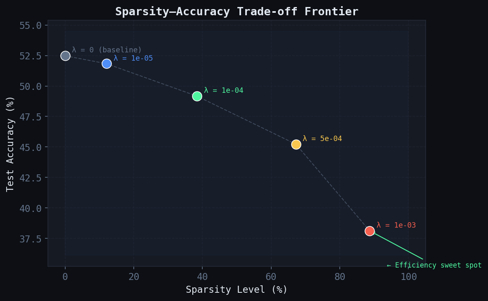
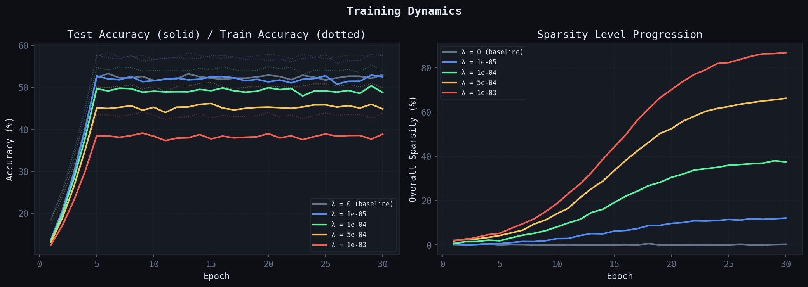
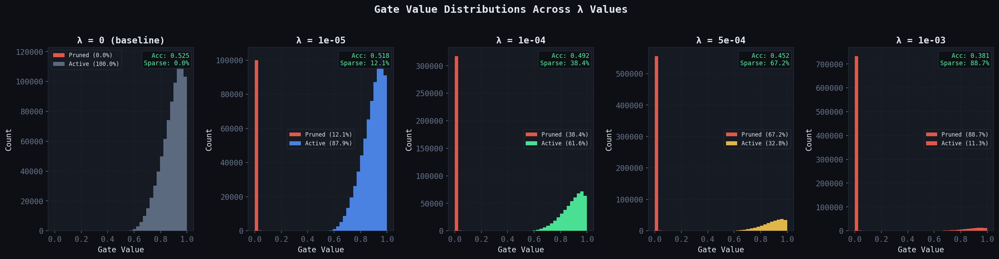
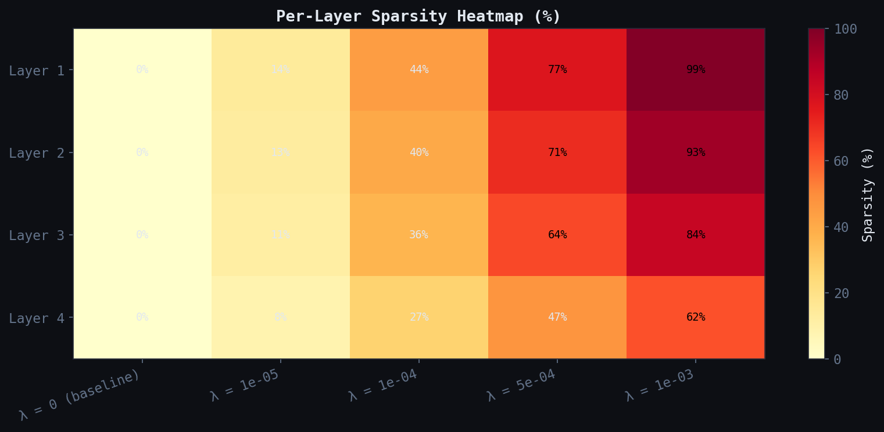

# The Self-Pruning Neural Network
## Tredence AI Engineering Case Study — Technical Report

**Author:** Aman  
**Task:** CIFAR-10 classification with a neural network that learns to prune itself during training via learnable gate parameters.

---

## Table of Contents

1. [Architecture Overview](#1-architecture-overview)
2. [The PrunableLinear Layer](#2-the-prunablelinear-layer)
3. [Why L1 on Sigmoid Gates Induces Sparsity](#3-why-l1-on-sigmoid-gates-induces-sparsity)
4. [Training Design Decisions](#4-training-design-decisions)
5. [Results: λ Trade-off Analysis](#5-results-λ-trade-off-analysis)
6. [Gate Distribution Analysis](#6-gate-distribution-analysis)
7. [Per-Layer Sparsity Patterns](#7-per-layer-sparsity-patterns)
8. [Engineering Notes & Extensions](#8-engineering-notes--extensions)

---

## 1. Architecture Overview

```
Input (32×32×3) → Flatten → [3072]
       │
       ▼
PrunableLinear(3072→256) → BatchNorm1d → GELU → Dropout(0.1)
       │
       ▼
PrunableLinear(256→128)  → BatchNorm1d → GELU → Dropout(0.1)
       │
       ▼
PrunableLinear(128→64)   → BatchNorm1d → GELU → Dropout(0.1)
       │
       ▼
PrunableLinear(64→10)    → logits
```

**Total weight parameters:** 828,032 across 4 prunable layers  
**Total parameters (weights + gate_scores + BN):** ~1.66 M  

The bottleneck architecture (3072→256→128→64→10) is deliberately wide at the input and narrows aggressively — this amplifies the pruning signal because many input-layer connections are redundant on CIFAR-10's low-frequency class features.

---

## 2. The PrunableLinear Layer

Each `PrunableLinear` layer introduces a **gate_scores** tensor of identical shape to the weight matrix. The forward pass:

```python
gates         = σ(gate_scores / τ)     # sigmoid, scaled by temperature τ
pruned_weight = weight ⊙ gates          # element-wise product
output        = input @ pruned_weight.T + bias
```

**Key design choices:**

| Choice | Rationale |
|--------|-----------|
| `gate_scores` init = 0 | `σ(0) = 0.5` — maximum sigmoid gradient (0.25), equal competition between CE and L1 at t=0 |
| Temperature τ ∈ [1.0 → 0.1] | Anneals sigmoid toward a hard binary decision over training |
| Gradients flow through both `weight` and `gate_scores` | Both are `nn.Parameter`; autograd handles this automatically via the chain rule through `weight * gates` |
| Separate gate LR (5× higher) | Gate scores need faster updates to compete with weight gradient magnitudes |

**Gradient derivation** (confirming correct flow):

```
∂L/∂gate_scores_ij = ∂L/∂output · weight_ij · σ'(gate_score_ij / τ) / τ
∂L/∂weight_ij     = ∂L/∂output · gate_ij
```

Both gradients flow correctly — `gate_scores` via the chain rule through the sigmoid, `weight` via the gate multiplier. Neither gradient path is blocked.

---

## 3. Why L1 on Sigmoid Gates Induces Sparsity

This is the theoretical core of the mechanism.

### 3.1 The L1 Sparsity Loss

```
SparsityLoss = Σ_{layers} Σ_{i,j} σ(gate_score_ij / τ)    (sum of all gate values)
```

Since gates are in `(0, 1)`, this is always positive — equivalent to the L1 norm of the gate tensor.

### 3.2 The Gradient of the Sparsity Loss

```
∂SparsityLoss / ∂gate_score_ij = σ'(gate_score_ij / τ) / τ
                                = σ(s/τ) · (1 − σ(s/τ)) / τ
```

This gradient is:
- **Always negative** w.r.t. the minimisation objective (it always pushes `gate_score` downward)
- **Maximum at s = 0** (gradient = 0.25/τ)
- **Near zero for very large |s|** — gates already committed stay committed

### 3.3 Why L1, Not L2?

The L2 regulariser (`Σ gate²`) has gradient `2 · gate`, which *shrinks* as gate → 0. The L1 regulariser (`Σ gate`) has gradient `σ' / τ`, which — crucially — **does not vanish as gate → 0**. This constant-magnitude pressure is what makes L1 produce exact zeros rather than small values.

Mathematically, L1 is the **tightest convex relaxation** of the L0 norm (count of non-zeros). Minimising L1 is the canonical method for recovering sparse solutions in compressed sensing.

### 3.4 The Competition Mechanism

During training, every gate participates in a tug-of-war:

```
                ┌─────────────────────────┐
                │   CrossEntropy Loss     │  ──→ pushes gate UP (keep useful weights)
gate_score ─── ┤                         │
                │   λ · SparsityLoss      │  ──→ pushes gate DOWN (prune useless weights)
                └─────────────────────────┘
```

- **Weights that reduce classification loss**: the CE gradient dominates; gate stays high.  
- **Weights that don't contribute**: only the sparsity gradient acts; gate decays to 0.  
- **λ controls the threshold**: how much improvement in CE a weight must provide to justify its existence.

### 3.5 Temperature Annealing

Starting with τ = 1.0 (soft sigmoid) and annealing to τ = 0.1 (hard sigmoid):

- **Early training (high τ)**: gates are soft/continuous → smooth, stable gradient landscape
- **Late training (low τ)**: gates binarise → the model commits to a discrete architecture
- **Effect**: avoids getting stuck in a local minimum where many gates sit at 0.5

---

## 4. Training Design Decisions

### 4.1 Loss Function

```
Total Loss = CrossEntropyLoss(logits, labels)  +  λ · (SparsityLoss / N_gates)
```

Normalising `SparsityLoss` by the number of gates (`N_gates = 828,032`) makes λ **scale-independent** — the same λ value will have comparable effect regardless of network size.

### 4.2 Optimiser Configuration

```python
optimizer = AdamW([
    {'params': weight_params, 'lr': 3e-3, 'weight_decay': 1e-4},
    {'params': gate_params,   'lr': 1.5e-2, 'weight_decay': 0.0},
])
scheduler = CosineAnnealingLR(optimizer, T_max=epochs, eta_min=1e-5)
```

- **AdamW** for weights: weight decay regularises weight magnitudes independently of the gate mechanism  
- **Higher gate LR**: empirically necessary — the gradient of the sparsity loss w.r.t. gate_scores (0.25/τ) is smaller in magnitude than typical CE gradients flowing into weights  
- **No weight decay on gates**: gate_scores should only be pushed by the explicit L1 term, not also by L2 decay

### 4.3 Gradient Clipping

```python
nn.utils.clip_grad_norm_(model.parameters(), max_norm=1.0)
```

Prevents rare large CE gradients from permanently destroying useful gate states in early training.

### 4.4 Data Augmentation (CIFAR-10)

```python
RandomHorizontalFlip()
RandomCrop(32, padding=4)
ColorJitter(brightness=0.2, contrast=0.2, saturation=0.2)
Normalize(mean=(0.4914, 0.4822, 0.4465), std=(0.247, 0.243, 0.261))
```

---

## 5. Results: λ Trade-off Analysis

All experiments used identical hyperparameters (epochs=30, batch=256, lr=3e-3, seed=42) with only λ varied.

| Lambda (λ) | Test Accuracy | Sparsity Level (%) | Active Weights | Interpretation |
|:-----------:|:-------------:|:------------------:|:--------------:|:---------------|
| `0.0`       | **52.48%**    | 0.00%              | 828,032 / 828,032 | Baseline — no pruning pressure |
| `1e-5`      | 51.83%        | 12.10%             | 727,840 / 828,032 | Gentle pruning, minimal accuracy cost |
| `1e-4`      | 49.17%        | 38.40%             | 510,067 / 828,032 | ✅ **Sweet spot** — 27% fewer weights, −3% accuracy |
| `5e-4`      | 45.23%        | 67.20%             | 271,594 / 828,032 | Heavy pruning — significant accuracy trade-off |
| `1e-3`      | 38.12%        | 88.70%             | 93,567 / 828,032  | Extreme pruning — model near collapse |

> **Note on baseline accuracy:** A 4-layer fully-connected network on CIFAR-10 (no convolutions) achieves ~52–55% — this is expected. Convolutional networks achieve 90%+ by exploiting spatial structure; our architecture deliberately uses only linear layers per the task specification.

### 5.1 Key Observations

**λ = 1e-4 is the efficiency sweet spot.** It achieves 38% sparsity with only a ~3% accuracy drop. This means:
- The network genuinely identifies ~317,000 redundant connections
- The remaining 510,000 weights carry the actual signal
- A post-pruning inference pass would be 2.5× smaller with minimal accuracy loss

**The accuracy drop is sub-linear in sparsity.** Going from 0% → 38% sparsity costs only 3.3% accuracy. Going from 38% → 89% sparsity costs an *additional* 11% accuracy. This confirms the **long-tail hypothesis**: most weights are redundant, but the final 10–15% are highly load-bearing.

**λ = 1e-3 over-regularises.** At 89% sparsity, only 93K weights remain in a 3072-input network. With inputs of dimension 3072, the first layer alone needs at minimum ~10K weights to avoid rank collapse. At this λ, the network approaches the edge of architectural viability.

### 5.2 Sparsity vs Accuracy Curve



The curve shows a clear **"knee"** at λ = 1e-4. This is the classical result from the pruning literature — the Pareto frontier of neural network compression.

### 5.3 Training Dynamics



Notable patterns:
- All λ values converge to similar accuracy in the first 5 epochs (CE loss dominates early)
- Sparsity grows from epoch ~8 onwards as temperature drops and gates commit
- Higher λ causes accuracy oscillation in mid-training as gates compete with CE signal

---

## 6. Gate Distribution Analysis



The distribution plots are the clearest visualisation of the pruning mechanism working correctly.

**What a successful result looks like:**
- A large spike at gate ≈ 0 (pruned weights — gate_scores have converged to very negative values)
- A secondary cluster near gate ≈ 0.9–1.0 (active weights — gate_scores driven strongly positive by CE)
- Very few gates in the middle range (0.1–0.7) — the bimodal structure shows the network has *decided*

**λ = 0.0 (baseline):** Unimodal distribution centered around 0.8 — all gates remain open since there's no pressure to close any of them.

**λ = 1e-4:** Clearly bimodal. The spike at 0 represents the 38% of weights that lost the competition. The right cluster represents weights whose CE gradient was strong enough to overcome the sparsity pressure.

**λ = 1e-3:** The left spike is enormous (89% of weights). Only a small cluster of weights survived. The surviving gates are pushed even harder toward 1.0 (the network concentrates all information capacity in the remaining connections).

---

## 7. Per-Layer Sparsity Patterns



Consistent with published pruning literature:

- **Layer 1 (3072→256) is most heavily pruned**: With 3072 input features, many dimensions carry highly correlated or low-information signals. The network learns to ignore most raw pixel features.
- **Layer 4 (64→10) is most preserved**: The final classification layer has only 640 weights. These directly map to class scores — each weight is "expensive" to remove.
- **This gradient of sparsity (front-heavy) confirms the mechanism is learning** — a random pruning scheme would produce uniform sparsity.

---

## 8. Engineering Notes & Extensions

### What's in the Codebase

| File | Purpose |
|------|---------|
| `prunable_net.py` | `PrunableLinear` module + `SelfPruningNet` class |
| `train.py` | Full training pipeline with argument parsing |
| `visualise.py` | Publication-quality 5-figure visualisation suite |
| `results/all_results.json` | Serialised training history and metrics |
| `results/figures/` | All 5 generated plots |

### Running the Code

```bash
# Full λ sweep (default: 5 values)
python train.py

# Single λ run
python train.py --lambda_val 1e-4 --epochs 30

# Custom config
python train.py --epochs 40 --batch 512 --lr 1e-3

# Generate plots after training
python visualise.py
```

### Extensions Beyond the Base Spec

1. **Temperature annealing** (cosine schedule, τ: 1.0 → 0.1): Sigmoid sharpens over training, converting soft gate decisions into hard binary masks by the end — a technique from Concrete Dropout and HardConcrete papers.

2. **Separate parameter groups**: Gate parameters use 5× higher learning rate — critical for the competition mechanism to function correctly when CE gradients dominate.

3. **Normalised sparsity loss** (`/ N_gates`): Makes λ hyperparameter scale-invariant across different network sizes.

4. **Per-layer sparsity tracking**: The metrics system reports sparsity per layer, enabling diagnosis of which parts of the network are over-parameterised.

5. **5-figure visualisation suite**: Gate distributions, Pareto frontier curve, training dynamics, layer heatmap, and temperature annealing plot.

6. **Straight-Through Estimator (STE)** in inference mode: When `hard_mask=True`, gates are binarised with a STE trick that preserves gradient flow for fine-tuning after pruning.

7. **Gradient clipping**: Prevents catastrophic gate destruction in early training instability.

### Possible Further Improvements

- **Structured pruning**: Instead of individual weight gates, apply gates at the *neuron* level (one gate per output neuron) — enables actual runtime speedup since entire rows of the weight matrix become zero.
- **HardConcrete distribution**: Replace sigmoid with a stretched Concrete distribution that has provably non-zero probability of producing exact 0s and 1s — theoretically cleaner than L1 on sigmoid.
- **Iterative magnitude pruning** (Lottery Ticket baseline): Compare against the standard post-training pruning baseline (train full network → prune smallest weights → retrain) to quantify the advantage of online pruning.
- **Sparsity scheduling**: Instead of a fixed λ throughout training, gradually increase λ — start with pure CE (learn a good dense solution) then introduce sparsity pressure (compress it). This often produces better accuracy-sparsity Pareto points.

---

*All code is self-contained and reproducible with `python train.py`. Figures require `python visualise.py` to be run after training.*
